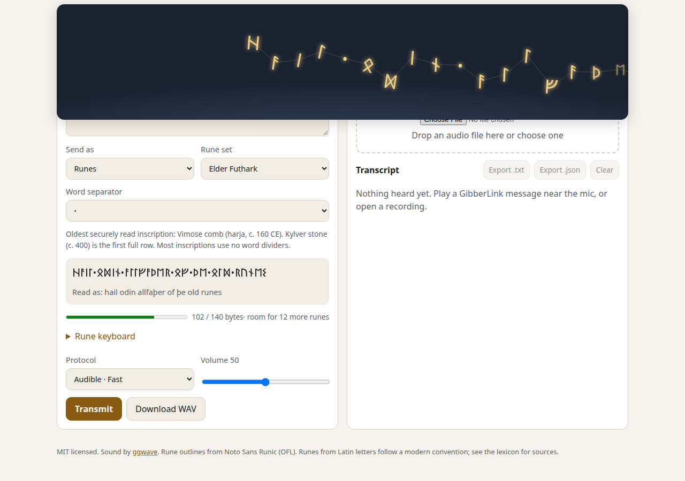

# GibberLink UI

GibberLink UI turns text or runes into GibberLink sound and turns that sound back into text. It runs in your browser. Nothing is uploaded, and the microphone audio stays on your device.



GibberLink is the data-over-sound protocol from the viral demo where two AI agents stopped talking and started beeping at each other. Under the hood it is [ggwave](https://github.com/ggerganov/ggwave), so anything this app sends can be read by other ggwave apps, and it can read theirs.

## What it does

Type a message and press Transmit. The app plays the sound, and each rune flies across the sky at the moment its bytes are on air. The runes stay in reading order, so the first one always leads.

You can also write in runes directly with the on-screen rune keyboard, or send plain text as typed.

To decode, open a recording or turn on the microphone and hold it near a speaker. Decoded runes appear with their Latin reading, and you can copy or export the transcript.

A single message holds 140 bytes. A rune takes 3 bytes in UTF-8, so that is 46 runes.

## Runes

Elder Futhark, the oldest attested runic alphabet (Vimose comb, around 160 CE), is the base. Anglo-Saxon Futhorc, Younger Futhark (long-branch and short-twig), medieval dotted runes, the Franks Casket cryptic runes, the golden-number runes and Tolkien's three Unicode runes build on it.

All of this lives in one data file, [`runic-lexicon.toon`](packages/core/data/runic-lexicon.toon). Each rune records its Unicode code point and name, its reconstructed name, transliteration, IPA and a source. The test suite checks every entry against Unicode 17.0 and confirms that all 89 characters of the Runic block are covered. Sources and open questions are in [`docs/research/runes.md`](docs/research/runes.md).

Scholars transliterate runes into Latin letters. There is no standard for the other direction, so turning English into runes follows a modern convention, and letters with no historical rune are marked as such in the data.

Words in rune text are separated by ᛫. You can pick ᛬, ᛭, a space, or no separator, which is how most Elder Futhark inscriptions were carved.

The app draws runes from embedded outlines taken from Noto Sans Runic, so they display correctly even on devices with no runic font, such as macOS and iOS.

## Development

Requires Node 22 or newer (Node 24 for the end-to-end fixture script).

```bash
npm ci
npm run dev -w @gibberlink/web   # http://localhost:5173
npm test                         # unit tests
npm run e2e                      # Playwright, with a fake microphone
```

The ggwave WebAssembly build is committed. To rebuild it you need [emsdk](https://emscripten.org/docs/getting_started/downloads.html):

```bash
bash packages/ggwave-wasm/build.sh
```

The repo is laid out like this:

```
packages/ggwave-wasm   pinned, reproducible ggwave build
packages/core          codec, WAV, runes, flock animation (no DOM)
packages/web           Svelte app
legacy/                the 2025 Python and Rust prototype
```

Project notes for contributors are in [`STATUS.md`](STATUS.md), [`ROADMAP.md`](ROADMAP.md) and [`docs/SPEC.md`](docs/SPEC.md).

## License

MIT. The ggwave sources are MIT. The Noto Sans Runic font subset and the rune outlines derived from it are under the SIL Open Font License 1.1 (see `packages/core/data/OFL-NotoSansRunic.txt`).
